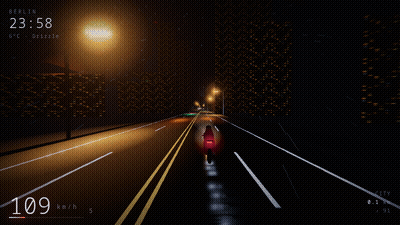

# Midnight Ride



An endless night ride. You get a motorcycle, a wet road, a city that keeps
rebuilding itself ahead of you, and music that follows the throttle. There is no
score, no fail state and nothing to unlock. You ride until you feel like stopping.

```bash
npm install
npm run dev          # http://127.0.0.1:5173
npm run build        # github pages build, into dist/
npm run build:itch   # itch.io upload, into midnight-ride-itch.zip
```

There are three builds and they differ only in where the page thinks it lives:
the dev server at the root, GitHub Pages at `/MidnightRide/`, and itch.io at a
generated path nobody knows in advance — so that one uses relative paths. Getting
this wrong produces a blank screen and a 404 for the bundle, which looks exactly
like a broken game.

## Controls

| | |
|---|---|
| `W` / `S` | throttle · brake |
| `A` / `D` | steer |
| `Shift` | boost |
| `E` | autopilot |
| `C` | camera (chase · close · cinematic · first person) |
| `F` | photo mode |
| `R` | cycle the rain |
| `M` | music on/off |
| `T` | push the clock forward an hour |
| `` ` `` | the developer panel — frame times, GPU time, what the reflections found |
| `1` … `4` | reflections · light shafts · road decals · quality profile |

## Riding itself

Leave the controls alone for twenty-five seconds and it takes over: holds a
lane, reads the next corner and arrives at a speed the corner allows, pulls out
for slower traffic, and drifts the camera between angles every half minute.
Touch anything and you have it back instantly, no confirmation, no transition.
`E` toggles it deliberately.

It is not an easy mode — there is nothing to be good at here. It is for the
times you want to watch rather than steer, and it is what makes the game
something you can leave running on a second screen.

## On a phone

It starts in autopilot, because being handed a throttle is not what you want
from a thing you opened on a phone. `AUTO` in the corner toggles it.

To ride yourself: **left thumb steers, right thumb rides.** Both are relative —
each touch remembers where it began, so you can put a thumb down anywhere
without the bike snapping sideways, and a resting thumb on the right just holds
the throttle open. Drag down on the right to brake.

Quality adapts to what the machine actually does rather than to what it claims
to be. Everything but a phone starts on the high tier; if the frame rate stays
under 45 for four seconds it steps down and it steps back up if the frame rate
recovers and holds. A profile sets the ceiling on the drawing buffer, how much
multisampling and post-process antialiasing it can afford, the bloom buffer's
resolution, how far the reflection pass may march, how many taps the radial blur
takes, rain density and how often the environment map is rebaked. The first version guessed from core count and window height, and put
a desktop running at 76 fps into the cut-down renderer — the telemetry caught it
in the very first session. Landscape only — portrait asks you to turn the phone.

## What is generated, and when

Nothing here is an asset file. There are no models, no textures and no audio in
the repository — all of it is built at runtime, which is why the whole thing
loads instantly and ships as one 950 kB bundle (280 kB gzipped), nearly all of
it Three.js and its antialiasing lookup tables.

**The road** is a centreline defined as a pure function of distance: curvature
and elevation are sums of sines, so kilometre 4,182 looks the same on every run
without anything being stored. Geometry is built 120 m at a time, seven chunks
ahead and two behind, and each chunk is merged down to roughly half a dozen draw
calls. Every 6 km the world is translated back to the origin so floating-point
precision never degrades on a long ride.

**Biomes** follow a weighted chain — city, tunnel, highway, forest, bridge, the
occasional lone petrol station — so the ride has a shape without ever repeating a
fixed loop.

**Long hauls** are the ride's larger rhythm. Every so often the generator commits
to ten to twenty kilometres with no city at all — four to seven minutes at speed.
Each chunk carries a *remoteness* value that ramps to 1 through the middle of it,
and everything reads from it: street lighting thins out and then stops, traffic
drops to almost nothing, the orange lid of light pollution lifts off the sky and
the stars come back, and one petrol station sits alone near the midpoint. A
kilometre or two before the next city the glow returns to the horizon ahead of
you, so you see the place before you reach it. Arriving somewhere only means
something if you have been nowhere first.

**Rare events** are deliberately, aggressively rare — an aeroplane every few
minutes is scenery, an aeroplane every twenty minutes is something you look up
at. A freight train runs the parallel line and settles into your pace for a
while. Another rider catches you, or you catch them, and they sit in the next
lane for a minute before winding it on. Occasionally the aircraft is not at
cruise but on approach, low enough to pass right over your head. A storm cell
moves through, throwing lightning every ten seconds or so, with the thunder
arriving a few seconds behind. And at the end of a long haul, a kilometre or two
out, the next city appears below the road as a field of lights before you drop
into it. Nothing is announced and nothing appears twice in a row.

## Coming back

The game remembers one thing about you: how far you have ridden, ever. Next time
you open it the title says `Welcome back, rider — 184 km travelled`. No levels,
no unlocks, no garage. That is the whole of the progression and it is going to
stay that way.

**Wet asphalt** is the one thing worth spending effort on at night. It comes from
three parts: a roughness map that leaves puddles smoother than the tarmac around
them, an environment map generated from the sky itself so a mirror surface has
something to mirror, and light "pools" and "smears" laid flat on the road under
every lamp, sign and neon strip.

**Sound** is a Web Audio graph. The engine is three detuned saws, a sub and a lot
of filtered noise, geared through a six-speed box, with revs chasing road speed
rather than tracking it exactly — that lag is most of the feel. On top: wind that
scales with the square of your speed, tyre roar that changes character off the
tarmac, rain on your helmet that a tunnel mutes, overrun crackle, doppler whoosh
for oncoming traffic, and thunder a few seconds after distant lightning.

**Music** is generated the same way. A minor-key progression with layers that
unlock as you accelerate — pads while cruising, an arpeggio from about 45 km/h,
drums and bass past 110, a lead motif past 160 — and a tempo that drifts from 82
to 102 BPM with the speedometer. The bloom pulses on the beat.

## Your night, specifically

The game reads your clock and your time zone. It names the place from the zone
(`Europe/Berlin` → `Berlin`), and the sky is graded to the actual hour: dusk at
19:00, deep black at 03:00, the first blue at 05:20. Start it at noon and the
daylight hours are folded into the small hours instead — it is still Midnight
Ride.

The weather is chosen for the calendar day and it is the same weather every time
you come back to it tonight — but it is a description of the night rather than a
constant. Showers arrive and pass as you ride: a Heavy Rain night is wet about
seven tenths of the way with breaks in it, a Clear one catches one shower in
twenty-five kilometres. The road then keeps the water for a while after the rain
stops, because tarmac soaks in seconds and dries in minutes, and that lag is
most of what makes a wet road look rained on rather than switched on.

## Layout

```
src/
  main.js        loop, physics, camera rigs, the glue
  road.js        centreline, chunk lifecycle, carriageway + paint
  props.js       what each biome puts beside the road
  geo.js         mesh builder, PRNG, easing
  assets.js      every texture and shared material, drawn on canvas
  bike.js        the motorcycle, the rider, the headlight, the spray
  traffic.js     pooled cars that politely move over
  events.js      the aeroplane, the train, the other rider, the storm
  rain.js        5000 GPU-resident streaks
  sky.js         gradient dome, stars, moon, environment map
  postfx.js      screen-space reflections, bloom held still between frames,
                 radial speed blur, chromatic fringe, grain, SMAA
  glow.js        every glow in the game, in one instanced draw call
  timeofday.js   clock → palette; time zone → place; distance → weather
  hud.js         the interface
  devhud.js      the developer panel, and the frame-time graph
  gputime.js     what the GPU actually spent, via the timer query
  input.js       keyboard and relative-drag touch
  autopilot.js   rides for you when you stop
  quality.js     the profiles, and the guard that picks between them
  photo.js       the free camera and the bokeh pass
  stream.js      the channel mode
  telemetry.js   one beacon per session, if an endpoint was given
  audio/
    core.js      context, bus, convolution reverb, noise
    engine.js    engine, wind, tyres, rain, whoosh
    music.js     the generative synthwave sequencer
    stations.js  the four stations and what makes each one itself
    traffic.js   the other vehicles, heard: doppler from the geometry
tools/test/      the suite; see tools/test/README.md
```

## Photo mode

`F` stops the world. Rain hangs in the air, the traffic holds still, and you get
a free camera around the bike: drag to orbit, wheel to dolly, shift-wheel for the
lens, `[` `]` to pull focus, `-` `=` for the amount of blur, `H` for a completely
clean frame, `Enter` to save a PNG.

The depth of field is real — a bokeh pass inserted ahead of the bloom, so out-of-
focus lights bloom the way they should. The saved image is the raw render: no
interface, no overlay, whatever you framed.

## Stream mode

```
index.html?stream=1
```

The same ride, directed as a channel. Autopilot only — it never hands the
controls back — the camera changes itself every thirty to ninety seconds, and
the interface becomes a station ident: clock, place and weather, speed, lifetime
distance, and where to go if you want to drive it yourself.

Two things are deliberately different from playing. It cruises at eighty to a
hundred and twenty rather than a hundred and ninety, with an occasional faster
stretch, because two hours of top speed on a second monitor is exhausting rather
than hypnotic. And the clock shows the hour the *sky* is set to rather than the
wall clock — daylight is folded into the small hours anyway, and printing
`04:43 PM` over an obviously midnight road is the one thing a viewer would
notice.

Nothing in the soundtrack comes from anywhere else: the engine, the weather and
the music are all oscillators and generated noise, so there is no third-party
audio in a broadcast of it.

## Recording

```bash
npm run dev                                  # in another terminal
npm run record -- --seconds 4 --webp --mp4   # writes docs/ride.*
```

Capturing from a browser normally produces a stuttering mess, because the
renderer runs at whatever speed the machine manages while a screenshot takes far
longer than a frame. So recording switches the simulation to a fixed timestep
and stops the loop after every frame until the capture asks for the next one.
The machine can take half a second per frame and the clip still comes out at an
exact, smooth 20 fps.

Two non-obvious things dominate the size of the resulting GIF. Film grain is the
first — it re-randomises every pixel every frame and defeats inter-frame
compression entirely, so it is switched off while recording (24 MB → 9.7 MB on
the first clip). Dithering is the second: coarse ordered dithering compresses
well but turns every lamp halo into concentric rings, so the encoder uses the
finest bayer pattern, which stays cheap because the pattern itself does not
change between frames.

`docs/ride.webp` is the same clip at a quarter of the size and a wider frame —
worth swapping into the README if everywhere you care about renders WebP.

## Measuring whether anyone rides

A store page counts views and plays, which look identical whether someone rode
for twenty minutes or closed the tab in ten seconds — and that difference is the
only thing worth knowing after a launch. So the game can send **one beacon per
session**, as the tab closes, with counters it already keeps:

- how long the session lasted, and which bucket it falls in
- how far they rode, and their top speed
- whether they had been here before (the lifetime odometer already knows)
- whether a frame ever rendered at all, and the average frame rate — a WebGL
  game that fails to start is indistinguishable from one nobody liked
- desktop or touch, quality tier, viewport rounded to the nearest 100 px
- autopilot share, photo-mode opens, screenshots saved, cameras used, and which
  of the rare events actually turned up

No cookies, no identifiers, no time zone, nothing per-frame. It is off unless an
endpoint is given at build time, so a plain `npm run build` ships a game that
phones nobody:

```bash
VITE_TELEMETRY_URL=https://example.com/mr npm run build:itch
VITE_TELEMETRY_MODE=pixel   # for endpoints that want a GET, e.g. GoatCounter
```

One implementation note worth keeping: the body is JSON but goes out as
`text/plain`. `application/json` is not a CORS-safelisted content type, so it
triggers a preflight — and a beacon fired during `pagehide` does not survive the
round trip. The request dies as an unanswered `OPTIONS` and you get silence
instead of data. The receiver just parses the body itself.

## Tests

```bash
npm test                    # everything
npm test -- visual          # one suite: music, world, budgets, visual
npm test -- visual --update # re-record the golden frames, then look at them
node tools/test/bench.mjs --knobs   # what each quality setting costs, on the real GPU
```

Nothing here is deterministic by nature — the road is seeded but the bike, the
autopilot and the audio all reach for `Math.random`, and the sky reads the wall
clock — so the harness replaces both clocks before any page script runs and
halts the frame loop, and time then only passes when a test asks for it. Two
runs of the same drive render the same bytes, which is what makes a golden frame
a test rather than a coin toss.

Correctness runs on SwiftShader, the software renderer, because every machine
draws identical bytes there. Cost runs on the actual graphics card, because on
SwiftShader the price of filling a pixel bears no relation to what a GPU charges
— a change that halves the fill rate can measure as a slowdown. The two are
never mixed.

`bench.mjs --knobs` prices one setting at a time by alternating it frame by
frame against an untouched profile, which is the only way to get a number out of
a card that changes its own clocks between one measurement and the next. Its
first row is the same profile compared with itself: that row has to come out at
1.00, and how far it strays is the smallest difference the rig can see.

## Licence

MIT. The code, and everything it generates, is yours to do as you like with.

## Console handle

`window.__mr` exposes the renderer, scene, road, bike, traffic, audio and the
ride state, plus `__mr.teleport(metres, speed)` for jumping down the road to look
at something.
